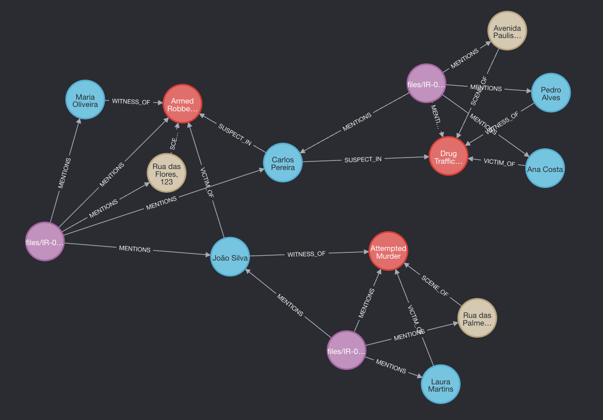
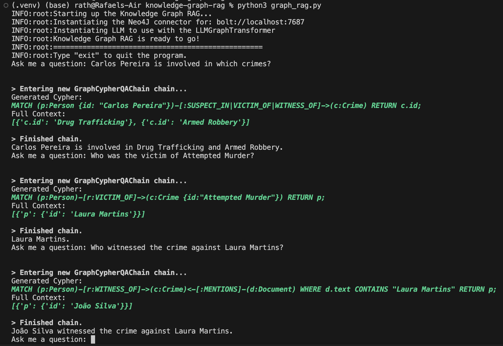

# Knowledge Graph RAG with Local LLM

This is an **<*ongoing*>** personal project aimed to practice building a pipeline to feed a Neo4J database from unstructured data from PDFs containing (fictional) crime reports, and then use a Graph RAG to query the database in natural language.

The pipeline is based on [Neo4J - Enhancing the Accuracy of RAG Applications With Knowledge Graphs](https://neo4j.com/developer-blog/enhance-rag-knowledge-graph/?mkt_tok=NzEwLVJSQy0zMzUAAAGTBn-WDr1KcupEPExYL6rh_DaP3R0h5gWQFxWGRm6dXiew5-oAnYBbvXvedknjyhyojNebyUa0ywWZwIkZQRtiJ-9x6k22vY3ru2Ztp7PjlgN5Bbs) article.

The GraphRAG is based on the YouTube tutorial [Langchain & Neo4j: Query Your Graph Database in Natural Language](https://www.youtube.com/watch?v=Wg445gThtcE).

Both parts of the project were adapted to use a locally hosted Neo4J database (Docker) and a locally hosted LLM (Ollama).


> *Stack:* Python, LangChain, Ollama, Neo4J, Docker

To run this project you'll need:
1) [Docker](https://www.docker.com/) installed and running on your machine (docker-compose.yml file included in the repository).
2) [Ollama](https://ollama.com/) installed and running on your machine, and a [model](https://ollama.com/library) downloaded.
3) A Python environment with the required packages installed. You can install them with `pip install -r requirements.txt`.
4) A .env file with the following variables:
```
NEO4J_URI=bolt://localhost:7687
NEO4J_USERNAME=neo4j
NEO4J_PASSWORD=neo4j
```

# The pipeline

pipeline.py -> main script to run the pipeline.

1) It extracts text from PDFs in the `files` folder.
2) Sends the text to the local LLM to extract entities and relationships.
* To use a I needed to build a custom chat_prompt, as pointed out in this [StackOverflow topic](https://stackoverflow.com/questions/78521181/llmgraphtransformer-convert-to-graph-documentsdocuments-attributeerror-str).
* I chose to also build my own Pydantic class and examples, instead of using the library's default, to align the model to the crime-related theme.
3) Inserts into the Neo4J database the extracted entities and relationships.

After running the pipeline script, check out the Neo4J database at `http://localhost:7474/browser/`:
```
MATCH (n)-[r]->(m)
RETURN n, r, m
```

You should see all the entities and relationships extracted from the PDFs.

Results using Llama3-8B model:




# The Graph RAG

graph_rag.py -> main script to run the Graph RAG Q&A.

1) It queries the Neo4J database with a natural language question.
2) It returns the answer in natural language based on the result of the query.

> Right now you need to write the questions using the same words as the entities and relationships in the database. I'm working on a way to make the questions more flexible...

Results using Llama3-8B model:


